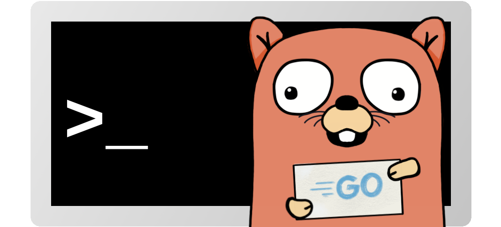

# Under Construction

# A[rg] Simple Command Line Parser for Go

## Why Use Arg?
Arg is a simple command line argument parser for Go. Why use arg? The answer is simple. Arg is simple to use!
Arg was not designed to be an all purpose command line parser. Arg's goal is to provide a simple programming model that is easy to use.

## What About Go's Flag Package?
Go's flag package is very capable of yielding very intricate command line interfaces at the programmer's expense. Anyone can use the flag
package for a few options and be happy. However, maintaining large CLIs can quickly become a problem as more commands are added.
Testing for nil values and remembering if a flag is optional or not will increase the cyclomatic complexity of the code.

## What About Cobra?
Without doubt, Cobra is the one of the most used CLI parsers for Go. Cobra, as the flag package, is very capable of creating rich CLIs.
However, this comes at a price that must be paid upfront. It takes some time to adapt and learn the many features of Cobra.

## Arg's Philosophies
Arg's core philosophies choose clarity over brevity, and simplicity over features. This means that CLIs created with
Arg are more verbose than POSIX compliant CLIs that allow flag stacking for example.

